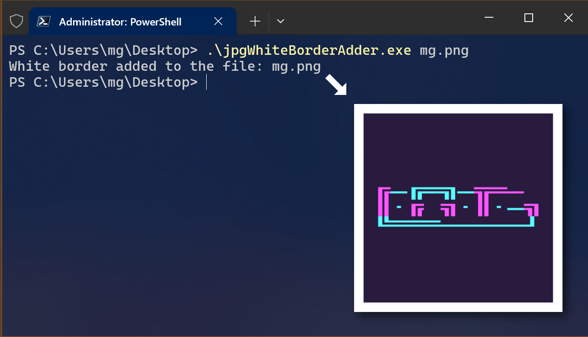

\


# jpgWhiteBorderAdder

Adds white border to JPG/PNG images.

## Features

- Border width: 5% of shortest side
- Preserves EXIF metadata (JPEG only)



## Usage
```bash
jpgWhiteBorderAdder.exe image.jpg
```

## License

[Unlicense](LICENSE)
