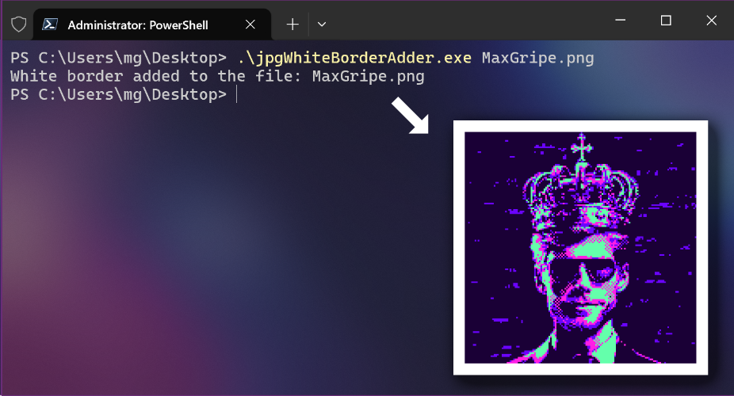

# jpgWhiteBorderAdder

Adds a white border to images in JPEG and PNG formats. The program is designed to automatically modify existing image files by adding a uniform white border around them.

## Features

- Supports JPEG and PNG formats.
- Automatically adds a white border with a width of 5% of the image's shortest side.
- Preserves EXIF metadata for JPEG images.



## How to use

### Command Prompt (cmd.exe)

```
Microsoft Windows [Version 10.0.19045.5247]
(c) Microsoft Corporation. All rights reserved.

C:\Users\mg>cd Desktop

C:\Users\mg\Desktop>jpgWhiteBorderAdder.exe aaaa.jpg
White border added to the file: aaaa.jpg

C:\Users\mg\Desktop>
```
### PowerShell
```PowerShell
PowerShell 7.4.6
PS C:\Users\mg> cd .\Desktop\

PS C:\Users\mg\Desktop> .\jpgWhiteBorderAdder.exe aaaa.jpg
White border added to the file: aaaa.jpg

PS C:\Users\mg\Desktop>
```

## License

This project is released under the [Unlicense](LICENSE) license.
